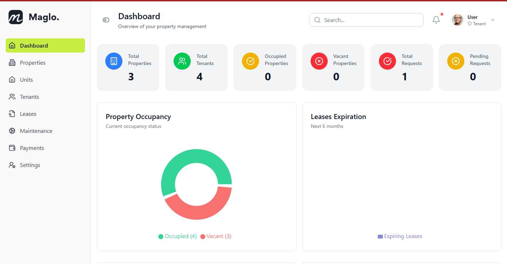
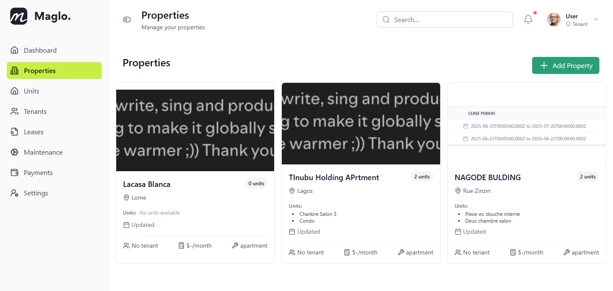
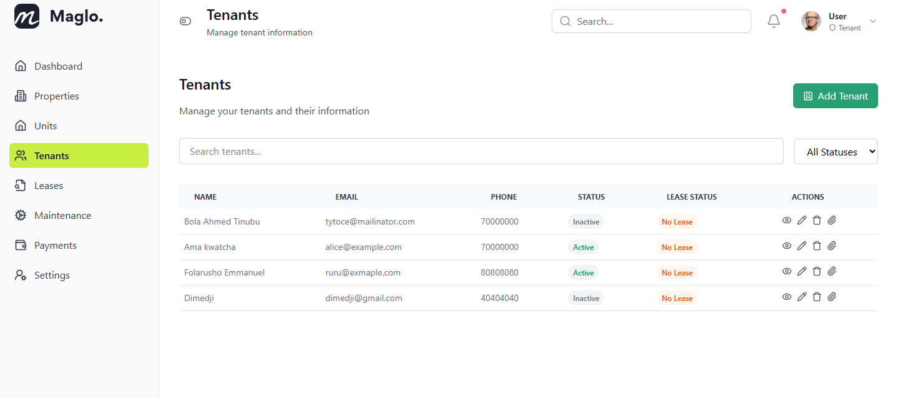
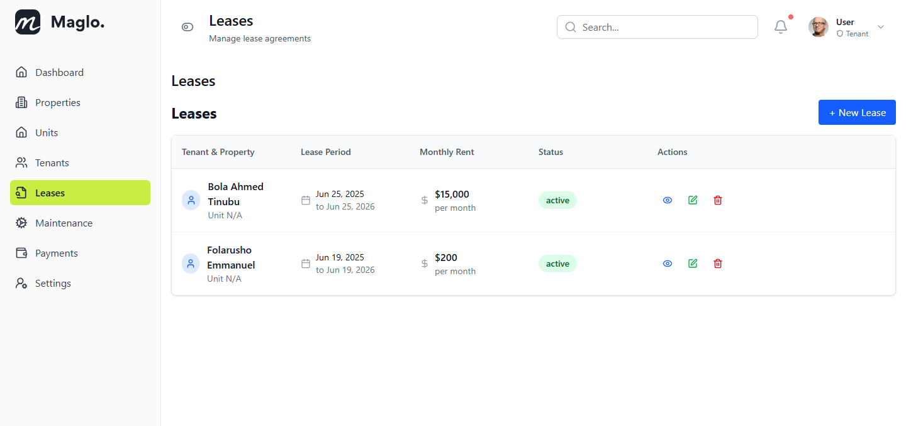
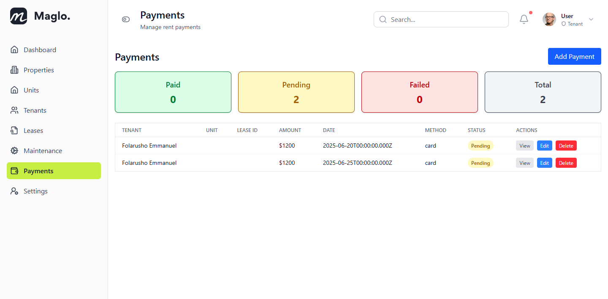
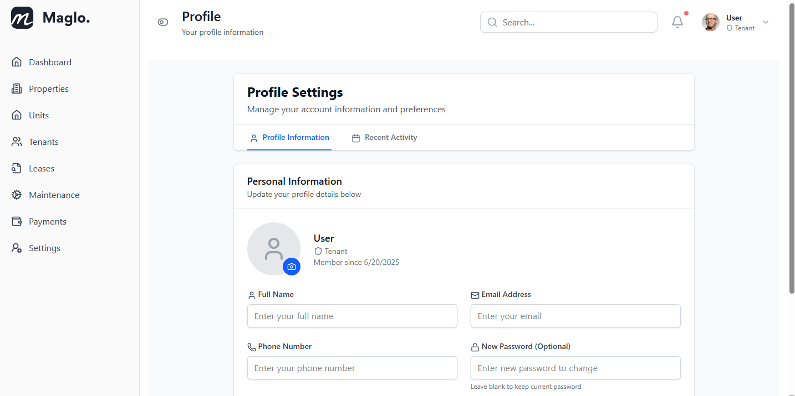
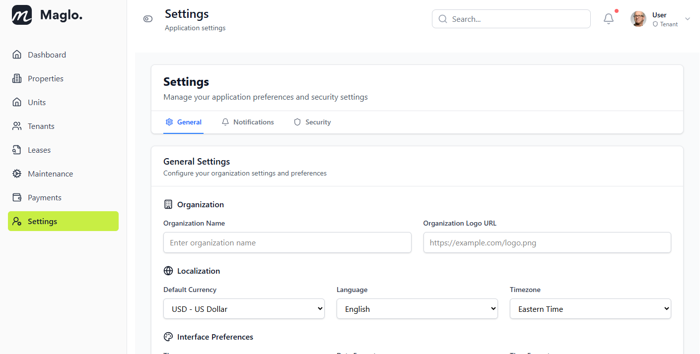

# Tenant Manager

**Tenant Manager** is a modern, full-stack web application designed to streamline rental property management for landlords and property managers. Built with a robust Node.js/Express backend and a sleek React (Vite) frontend, it offers an intuitive dashboard, powerful automation, and a delightful user experience.

---

## ✨ Features

- **Property & Unit Management**: Add, edit, and track properties and their units with ease.
- **Tenant Management**: Centralized tenant profiles, lease assignments, and contact info.
- **Lease Tracking**: Automated lease status, expiration alerts, and renewal management.
- **Maintenance Requests**: Submit, track, and resolve maintenance issues efficiently.
- **Rent Payments**: Monitor payment status, history, and outstanding balances.
- **Dashboard & Analytics**: Visualize key metrics and trends at a glance.
- **Role-Based Access**: Secure authentication and user roles for admins and tenants.
- **Responsive Design**: Works beautifully on desktop and mobile.

---

## 📸 Screenshots

<div align="center">
  
  <br/>
  
  
  <br/>
  
  
  <br/>
  
  
</div>

---

## 🏗️ Project Structure

```
backend/    # Node.js/Express API server
frontend/   # React + Vite frontend
screenshots/ # App screenshots for demo/portfolio
```

---

## 🚀 Getting Started

1. **Clone the repository**

   ```sh
   git clone https://github.com/yourusername/tenant-manager.git
   cd tenant-manager
   ```

2. **Install dependencies**

   ```sh
   cd backend && npm install
   cd ../frontend && npm install
   ```

3. **Configure environment variables**

   - Copy `.env.example` to `.env` in both `backend/` and `frontend/` and update as needed.

4. **Start the backend server**

   ```sh
   cd backend && npm start
   ```

5. **Start the frontend app**

   ```sh
   cd frontend && npm run dev
   ```

6. **Visit** [http://localhost:5173](http://localhost:5173) in your browser.

---

## 🛠️ Tech Stack

- **Frontend:** React, Vite, Tailwind CSS, React Router, Axios
- **Backend:** Node.js, Express, MongoDB, Mongoose, JWT Auth
- **Other:** ESLint, dotenv, React Toastify
---

## 💡 Why Tenant Manager?

- **Recruiter-Friendly:** Clean code, modular structure, and modern best practices.
- **Portfolio-Ready:** Real-world features, attractive UI, and responsive design.
- **Extensible:** Easily add integrations (payments, notifications, etc.) or new modules.

---

## 📬 Contact

Want to know more or see a live demo?  
**Email:** [My Email](samuelmaglodji@gmail.com)
---
**LinkedIn:** [My Linkedin Profile](https://www.linkedin.com/in/kojo-samuel-maglodji-2a1081319/)

